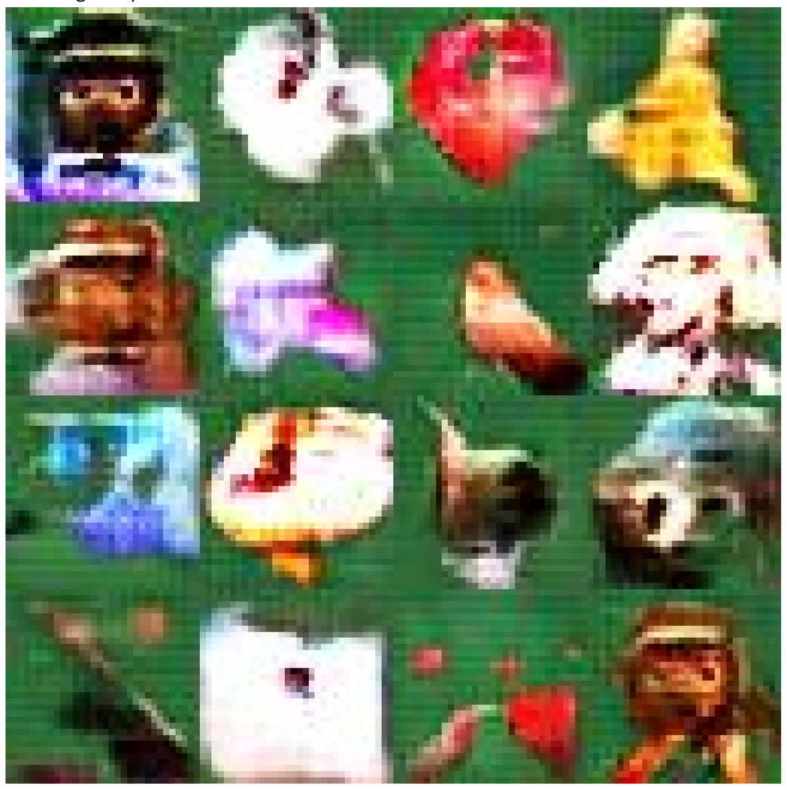
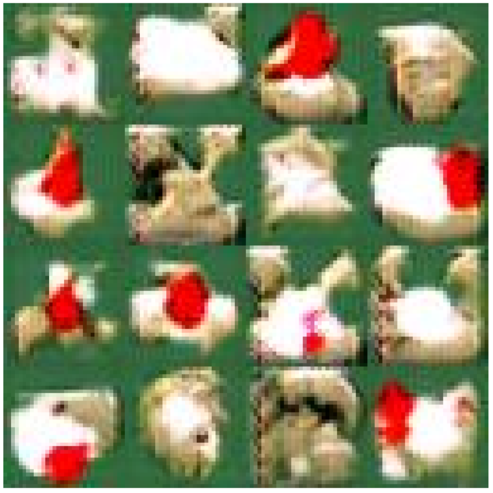
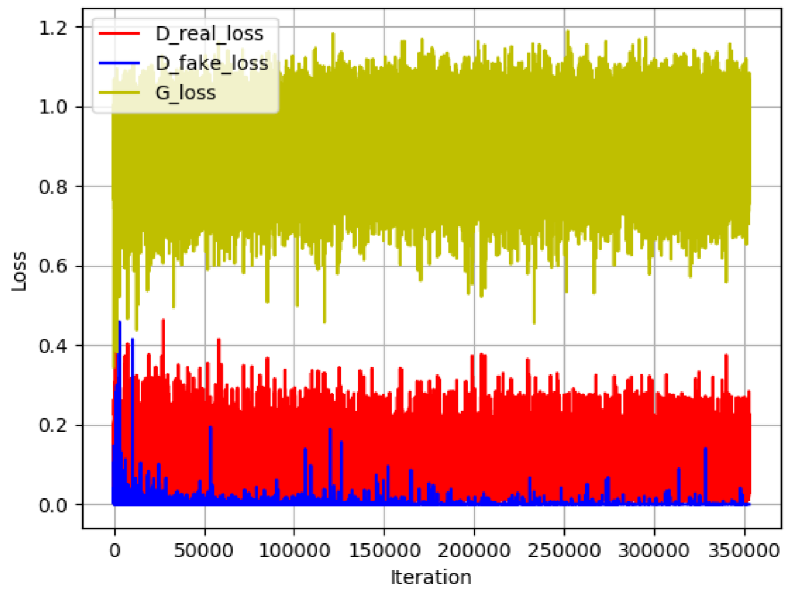
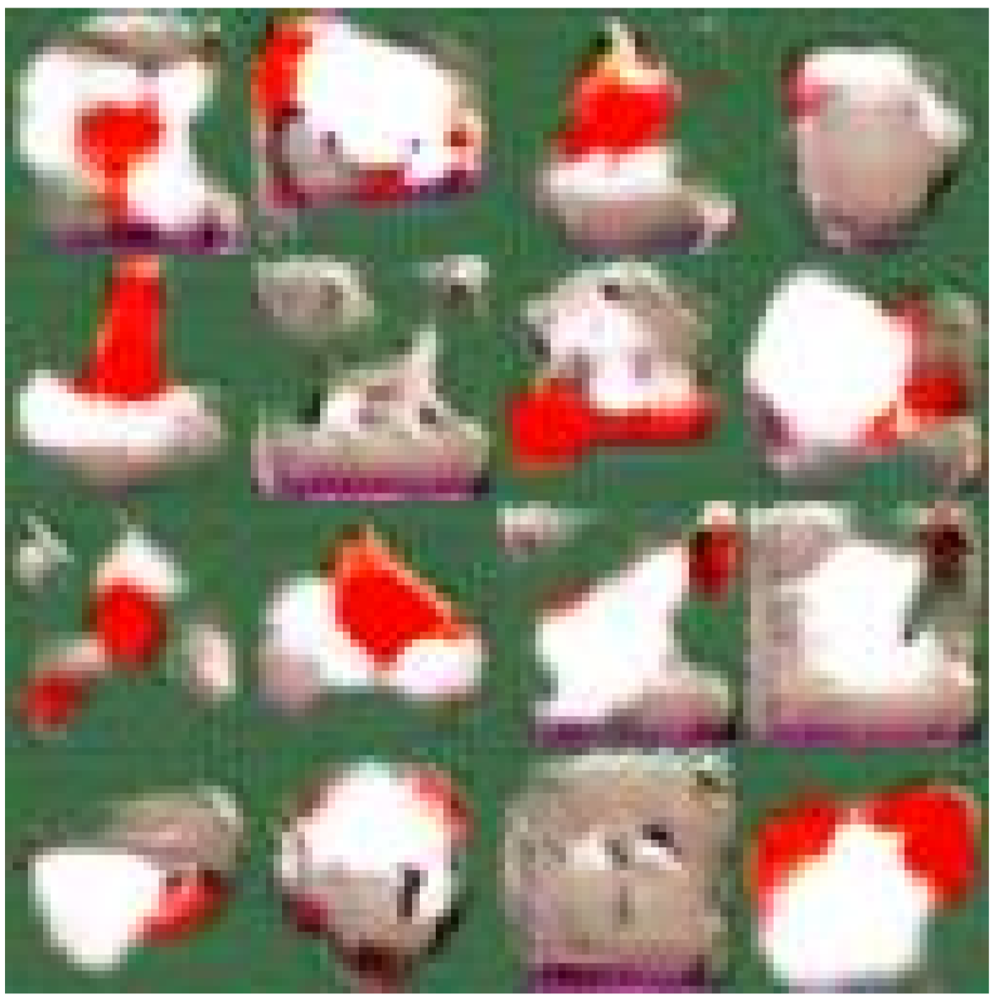
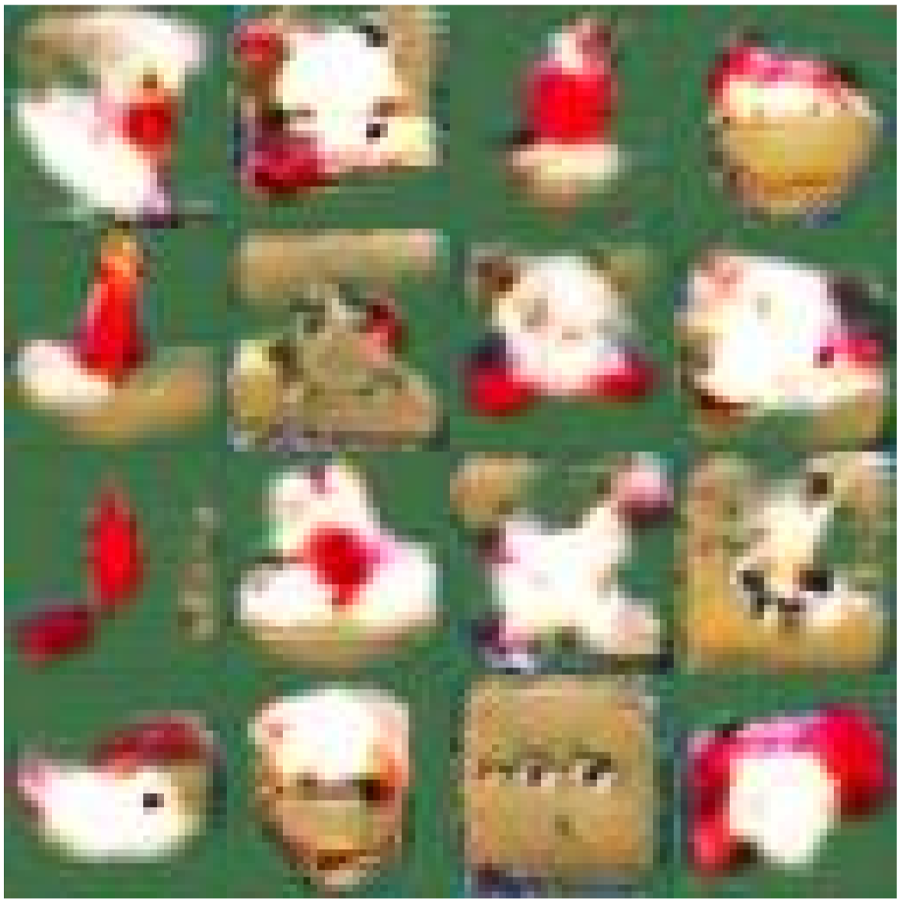
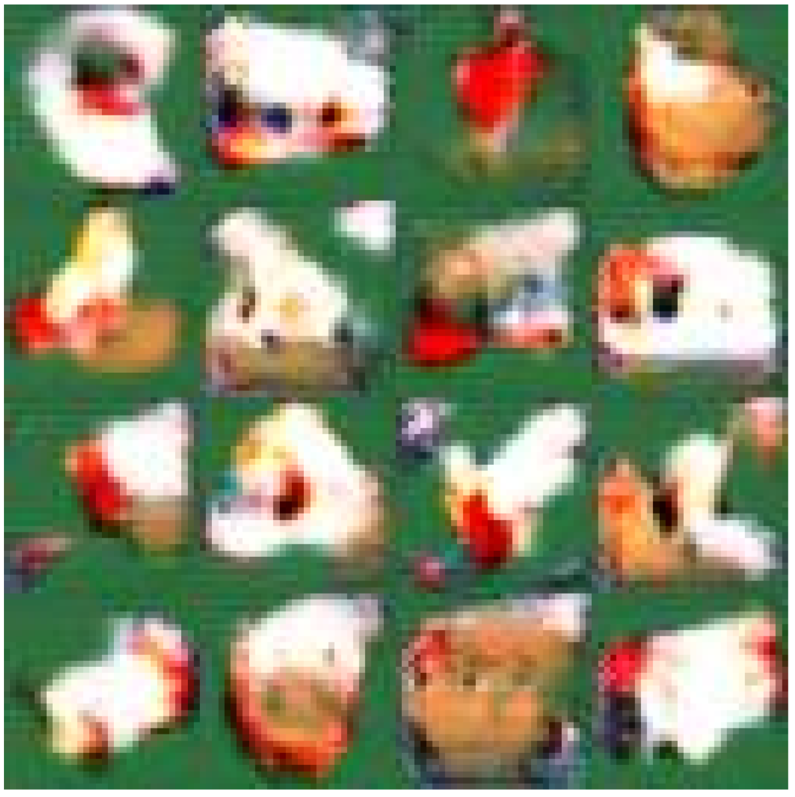

# Image-Generation-DCGAN-PyTorch
## Overview
We use DCGAN to generate 32 by 32 images with PyTorch.

## Experiment Result
                                                    After 704800 iterations

                                                Modified After 350000 iterations

                                                            Loss

                                                Modified After 200000 iterations

                                                Modified After 100000 iterations

                                                Modified After 50000 iterations

